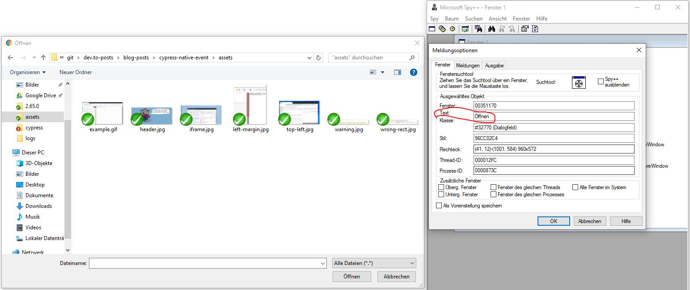
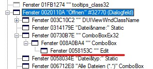

>**Note**: Get the code [here](https://github.com/gabbersepp/dev.to-posts/tree/master/blog-posts/cypress-file-chooser/code)

OK. So you decided to do a real file upload test in Cypress? I appreciate your decision! First you should read through this post:



Now I have to warn you: **This solution will only work on Windows!**

# My solution - quick and dirty
I make use of the fact that Chrome uses the system file dialog and not something own. Due to that we can rely on the Windows Messaging system and can control the dialog by Win32 API calls. I won't go too much into the details because there are a bunch of good tutorials out there that describe the Win32 API and the Windows Messages better than me ever could. :smile:

# Using Win32 API Calls in CSharp
To use functions like `SendMessage` and `FindWindowEx` you have to load `user32.dll`. To make your `C#` life easier, I recommend the usage of [PInvoke.net](http://pinvoke.net/default.aspx/user32.FindWindowEx), a collection of many calls into the system DLLs and often with some example code!

In my case I was able to copy & paste the example for `SendMessage` and `FindWindowEx` without adjustments.

# File Dialog Handles
Let's examine the Window structure of the dialog. I use `Microsoft Spy++` for this task. You can find it in your `Visual Studio` installation path:
```
C:\Program Files (x86)\Microsoft Visual Studio\2019\Professional\Common7\Tools\spyxx_amd64.exe
```

First we look for a Window whose title is *Öffnen / Open*:



Now as we have the parent handle, we can successively go downwards and select the `ComboBoxEx32 > ComboBox > Edit`:



The code is very simple:

```cs
// ./code/tool/Tool/Tool/Program.cs#L21-L26

IntPtr fileChooserHandle = FindHandle(IntPtr.Zero, null, "Öffnen");

var comboboxExHandle = FindHandle(fileChooserHandle, "ComboBoxEx32", null);
var comboboxHandle = FindHandle(comboboxExHandle, "ComboBox", null);
var editHandle = FindHandle(comboboxHandle, "Edit", null);
var btnHandle = FindWindowEx(fileChooserHandle, IntPtr.Zero, "Button", null);
```

I use a fail-safe implementation that tries several times to get the handle. Actually I only need this for the `fileChooserHandle` because it may take some time to open the dialog. If we request the handle to early, the whole process will fail.

```cs
// ./code/tool/Tool/Tool/Program.cs#L37-L56

static IntPtr FindHandle(IntPtr parentHandle, string className, string title)
{
  IntPtr handle = IntPtr.Zero;

  for (var i = 0; i < 50; i++)
  {
    handle = FindWindowEx(parentHandle, IntPtr.Zero, className, title);

    if (handle == IntPtr.Zero)
    {
      Thread.Sleep(100);
    }
    else
    {
      break;
    }
  }

  return handle;
}
```

# Setting the file path
We just have to send `WM_SETTEXT` message to the `Edit` component and click the "*Öffnen / Open*" button:

```cs
// ./code/tool/Tool/Tool/Program.cs#L28-L34

// WM_SETTEXT
SendMessage(editHandle, 0x000C, IntPtr.Zero, new StringBuilder(args[0]));

// LeftButtonDown
SendMessage(btnHandle, 513, IntPtr.Zero, null);
// LeftButtonUp
SendMessage(btnHandle, 514, IntPtr.Zero, null);
```

# Calling it from Cypress.io
You have to add a new task:

```js
// ./code/cypress/cypress/plugins/index.js#L37-L43

selectFile: async(value) => {
  return new Promise(resolve => {
    execFile("C:/git/dev.to-posts/blog-posts/cypress-file-chooser/code/tool/Tool/Tool/bin/Debug/Tool.exe", [value], {}, (error) => {
      resolve("ready" + JSON.stringify(error));
    })
  })
},
```

Don't forget the `execFile` import:
```js
const {execFile} = require("child_process")
```

And use it as always:

```js
// ./code/cypress/cypress/integration/spec.js#L15-L26

cy.get("input").first().then($element => {
  const element = $element[0];
  element.scrollIntoView();
  var rect = element.getBoundingClientRect();
  // wait only needed for demonstration purposes
  cy.task("nativeClick", {x: parseInt(rect.x) + addX, y: parseInt(rect.y) + addY })
  .wait(1000)
  .task("selectFile", "C:\\git\\dev.to-posts\\blog-posts\\cypress-file-chooser\\code\\cypress\\package.json")
  .wait(1000)
  .get("div", { timeout: 10000 })
  .should("contain", "package.json")
})
```

# Caveats
+ If you have two file dialogs open, the outcome of that search is not deterministic! If this is the case in your setup you have to adjust the code that looks for the dialog handle. I just made it very simple. You can of course adjust the search logic just as you need it.
+ Use backslashes in the path! Otherwise the file dialog won't accept the path!

# Additional Links
[Microsoft Spy++](https://docs.microsoft.com/de-de/visualstudio/debugger/how-to-start-spy-increment?view=vs-2019)
[Windows Messages](https://docs.microsoft.com/en-us/windows/win32/winmsg/messages-and-message-queues)
[WM_LBUTTONDOWN](https://docs.microsoft.com/en-us/windows/win32/inputdev/wm-lbuttondown)
[WM_LBUTTONUP](https://docs.microsoft.com/en-us/windows/win32/inputdev/wm-lbuttonup)
[PInvoke.net: Win32 API Calls in .NET](http://pinvoke.net)

# Summary
I showed you how you can control the File Dialog. Using this approach you can build very realistic file upload test scenarios. This approach can be extended to other use cases as well. Let me know if you have another use case for that!

----

# Found a typo?
As I am not a native English speaker, it is very likely that you will find an error. In this case, feel free to create a pull request here: https://github.com/gabbersepp/dev.to-posts . Also please open a PR for all other kind of errors.

Do not worry about merge conflicts. I will resolve them on my own. 
