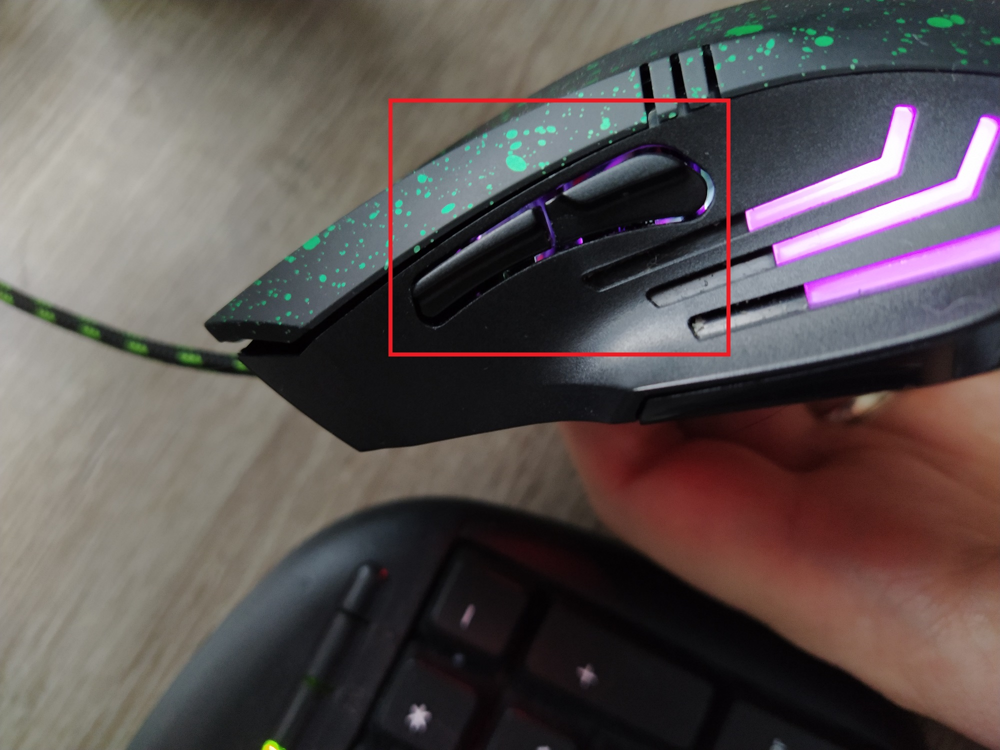
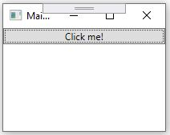
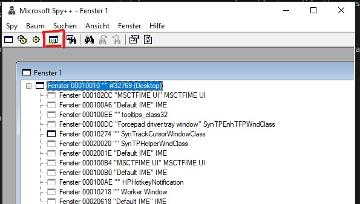
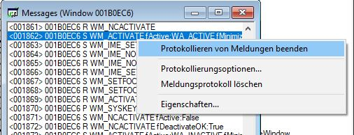
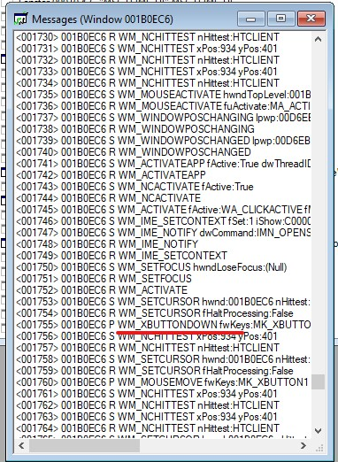
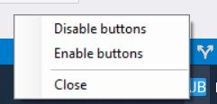

>**Note:** Get the code here: [Full runnable example](https://github.com/gabbersepp/dev.to-posts/tree/master/blog-posts/get-rid-of-mouse-buttons/code)

A few months ago my computer mouse stopped working so I bought one of those cheap ones. It is working like a charm but unfortunately it has two very very annoying side buttons:



I don't remember ever using them. Most of the time they and me coexist peacefully but sometimes (often when my wife is in front of the computer) the get clicked accidentally. It is not a drama after all, you think? Well it is if you are sitting in front of your email provider's sending mask, typing a large text into it and accidentally click this strange side button that is mapped to the *back* button...

So I always wanted to get rid of them, but:

+ Windows is not able to control those buttons
+ the manufacturer does not provide a software for it
+ removing the buttons from the mouse is not really a satisfactory solution for that problem

# The very last solution
Today I scanned my bookshelf and suddenly an old book, bought and read about 12 years ago, catches my eye:


After reading the table of contents:


I saw the part with *Hooks*. And suddenly something I've done several years ago came back into my mind. Windows is based upon a [message system](https://docs.microsoft.com/en-us/windows/win32/winmsg/messages-and-message-queues) and there is a powerful function that let's you inspect every message. And in one case you are also able to modify the messages. So maybe you got my idea: Listen to a specific message and omit it so that the mouse click message never reaches any application.

# Windows Message
If you press a key, someone sends somewhere a `WM_CHAR` message. If you press the left mouse button, a `WM_LBUTTONDOWN` is sent. Those events are fetched by applications that respond to them or skip them.
E.g. having a WPF application with just a single button introduces a consumer of `WM_LBUTTOMDOWN` events and of course it also consumes the corresponding `WM_LBUTTONUP` events.



# See windows messages in action
If you have `Visual Studio` installed, you have access to a little tool from Microsoft, called `Spy++`. You find it in the installation directory, e.g.:

```
C:\Program Files (x86)\Microsoft Visual Studio\2019\Professional\Common7\Tools
```

The folder contains two versions, a 32 Bit and a 64 Bit version. You must choose it based on the bitness of the application you want to inspect. The WPF application is executed as 32Bit application so I open that version. Click onto the button I've marked red in this screenshot. A new window appears:




Now click onto the crossfade, hold the button, move it over the application you are interested in and click the "*OK*" button. You are now tracing that application:


You see, there is a bunch of messages that were emitted all the time.

# Determine the right message
So you know that there is a message if something happens on the keyboard or the mouse. How do you know what message we are interested in? Just trigger it and "listen" to the message stream. In this case I recommend to remember the last row number:


Then place the mouse over the test app and press one of the side button. In my case the last message right before the click was: **1730** Right click onto the message stream and stop recording:



You now have a bunch of new messages. I wish you luck in finding the right one :smile: In my case I assumed that `WM_XBUTTONDOWN` is what I am looking for:



Of course, just an assumption.

# Hooking 
We have to differentiate between a `local hook` and a `global hook`. As stated in [the official documentation](https://docs.microsoft.com/en-us/windows/win32/winmsg/about-hooks#hook-procedures) a global hook can monitor all events in all threads and must be placed into a own DLL.

To register a hook, we use [SetWindowsHookEx](https://docs.microsoft.com/de-de/windows/win32/api/winuser/nf-winuser-setwindowshookexa). It requires the `type of the hook` as first parameter. To get a full list of possible values, refer [to the official documentation](https://docs.microsoft.com/de-de/windows/win32/api/winuser/nf-winuser-setwindowshookexa?redirectedfrom=MSDN#parameters).

# Blocking a message
We are interested in `WH_GETMESSAGE`. Whenever a windows application calls `GetMessage()` to retrieve the next message for dispatching (every application is doing this all the time :smile:), `WH_GETMESSAGE` is emitted. This is the only place where [you can modify the message](https://docs.microsoft.com/de-de/previous-versions/windows/desktop/legacy/ms644981(v=vs.85)#remarks). After returning from the hook callback, the message is passed to the application that calls `GetMessage()`. So whatever you write into the message will be visible to to the caller. This means, here we can adjust the message to prevent `WM_XBUTTONDOWN` being processed. To do so, replace the original message with `WM_NULL`.

# Writing the start application
My intention is, to have a small application, staying in the `systray`, that provides three functions:
+ Enable Buttons
+ Disable Buttons
+ Close App

## Calling unmanaged code from C#
As already mentioned, we need a DLL to make this happen. I am writing the DLL in C++ and thus we need to call unmanaged code from our managed application. Fortunately C#/.NET makes it easy for us to do so! Let's say there exist two methods: `SetHook` and `RemoveHook` (with `std calling convention`) and the DLL will be named *DLL1.dll*, then you simple have to put those two `DllImport` statements at the root of the application's class:

```cs
[DllImport("Dll1.dll", CallingConvention = CallingConvention.StdCall)]
public static extern void SetHook();

[DllImport("Dll1.dll", CallingConvention = CallingConvention.StdCall)] 
public static extern void RemoveHook();
```

Very easy! 

## Systray Icon
There is nothing special about the code. I used a WinForms application type because there it is much easier to setup a systray icon than with a WPF application.

```cs
// ./code/App/Program.cs

using System;
using System.Drawing;
using System.Runtime.InteropServices;
using System.Windows.Forms;

namespace App
{
    static class Program
    {
        private static NotifyIcon notifyIcon;

        [DllImport("Dll1.dll", CallingConvention = CallingConvention.StdCall)]
        public static extern void SetHook();
    
        [DllImport("Dll1.dll", CallingConvention = CallingConvention.StdCall)] 
        public static extern void RemoveHook();

        private static void SetText(bool? disabled = null)
        {
            notifyIcon.Text = "Disable XButton App";

            if (disabled == true)
            {
                notifyIcon.Text += " [Disabled]";
            } 
            else if (disabled == false)
            {
                notifyIcon.Text += " [Enabled]";
            }
        }

        private static void InitIcon()
        {
            notifyIcon = new NotifyIcon();
            notifyIcon.Icon = new Icon("example.ico");
            SetText();
            notifyIcon.Visible = true;
            notifyIcon.ContextMenuStrip = GetContextMenu();
        }

        private static ContextMenuStrip GetContextMenu()
        {
            var cm = new ContextMenuStrip();
            var item = new ToolStripMenuItem();
            item.Text = "Disable buttons";
            item.Click += DisableClick;
            cm.Items.Add(item);
            
            item = new ToolStripMenuItem();
            item.Text = "Enable buttons";
            item.Click += EnableClick;
            cm.Items.Add(item);
            cm.Items.Add(new ToolStripSeparator());

            item = new ToolStripMenuItem();
            item.Text = "Close";
            item.Click += CloseClick;
            cm.Items.Add(item);

            return cm;
        }

        private static void CloseClick(object sender, EventArgs e)
        {
            Application.Exit();
        }

        private static void EnableClick(object sender, EventArgs e)
        {
            SetText(false);
            RemoveHook();
        }

        private static void DisableClick(object sender, EventArgs e)
        {
            SetText(true);
            SetHook();
        }

        [STAThread]
        static void Main()
        {
            Application.EnableVisualStyles();
            Application.SetCompatibleTextRenderingDefault(false);
            InitIcon();
            Application.Run();
            notifyIcon.Dispose();
        }
    }
}

```

Result:



# Writing the DLL
I just created a new `DLL project` in `Visual Studio` and deleted everything I don't need. This is what was left:

```cpp
// ./code/Dll1/dllmain.cpp#L1-L16

#include "pch.h"

HHOOK hkKey = NULL;
HINSTANCE hInstHookDll = NULL;
LRESULT CALLBACK GetMsgProc(int code, WPARAM wParam, LPARAM lParam);

BOOL APIENTRY DllMain(HANDLE hModule, DWORD  reasonForCall, LPVOID lpReserved)
{
    switch (reasonForCall)
    {
    case DLL_PROCESS_ATTACH:
        hInstHookDll = (HINSTANCE)hModule;
        break;
    }
    return TRUE;
}
```

Then we need a function that can set the hook:

```cpp
// ./code/DLL1/dllmain.cpp#L18-L21

void __stdcall SetHook()
{
    if (hkKey == NULL)
        hkKey = SetWindowsHookEx(WH_GETMESSAGE, GetMsgProc, hInstHookDll, 0);
```

And one that can remove the hook:

```cpp
// ./code/DLL1/dllmain.cpp#L24-L29

void __stdcall RemoveHook()
{
    if (hkKey != NULL)
        UnhookWindowsHookEx(hkKey);
    hkKey = NULL;
}
```

The main part surely is the hook callback:

```cpp
// ./code/DLL1/dllmain.cpp#L31-L41

LRESULT CALLBACK GetMsgProc(int code, WPARAM wParam, LPARAM lParam)
{
    if (code >= 0 && code == HC_ACTION)
    {
        MSG* msg = (MSG*)lParam;
        if (msg->message == WM_XBUTTONDOWN || msg->message == WM_XBUTTONUP) {
            msg->message = WM_NULL;
        }
    }
    return CallNextHookEx(hkKey, code, wParam, lParam);
}
```

What happens in this few line of code:
+ `int code`: according to the [Microsoft documentation](https://docs.microsoft.com/en-us/previous-versions/windows/desktop/legacy/ms644981(v=vs.85)#parameters) we can forward this call to the next hook if `code <> HC_ACTION`
+ `lParam` contains a pointer to a `MSG` struct
+ if the message is equal to `WM_XBUTTONDOWN` or `WM_BUTTONUP` replace the message with `WM_NULL` 

# 32 Bit vs. 64 Bit
The hook DLL is injected into every process. The hook code is executed within the context of the hooked application. This means that using a 32 Bit DLL will block the XButtons in 32Bit applications but not in 64Bit applications. If you want to block the buttons in all applications, you must create a 32Bit and a 64Bit DLL.

# Summary
I showed you how you can block mouse buttons using only a few lines of code. This approach can be extended to many other use cases, too.

# Additional Links
[System-Wide-Hooking-for-the-WM-CHAR-Message](https://www.codeproject.com/Articles/50397/System-Wide-Hooking-for-the-WM-CHAR-Message)
[Hook on Mouse with Win32 api](https://causeyourestuck.io/2015/12/27/set-a-mouse-hook-with-win32api-2/)

----

# Found a typo?
As I am not a native English speaker, it is very likely that you will find an error. In this case, feel free to create a pull request here: https://github.com/gabbersepp/dev.to-posts . Also please open a PR for all other kind of errors.

Do not worry about merge conflicts. I will resolve them on my own. 
