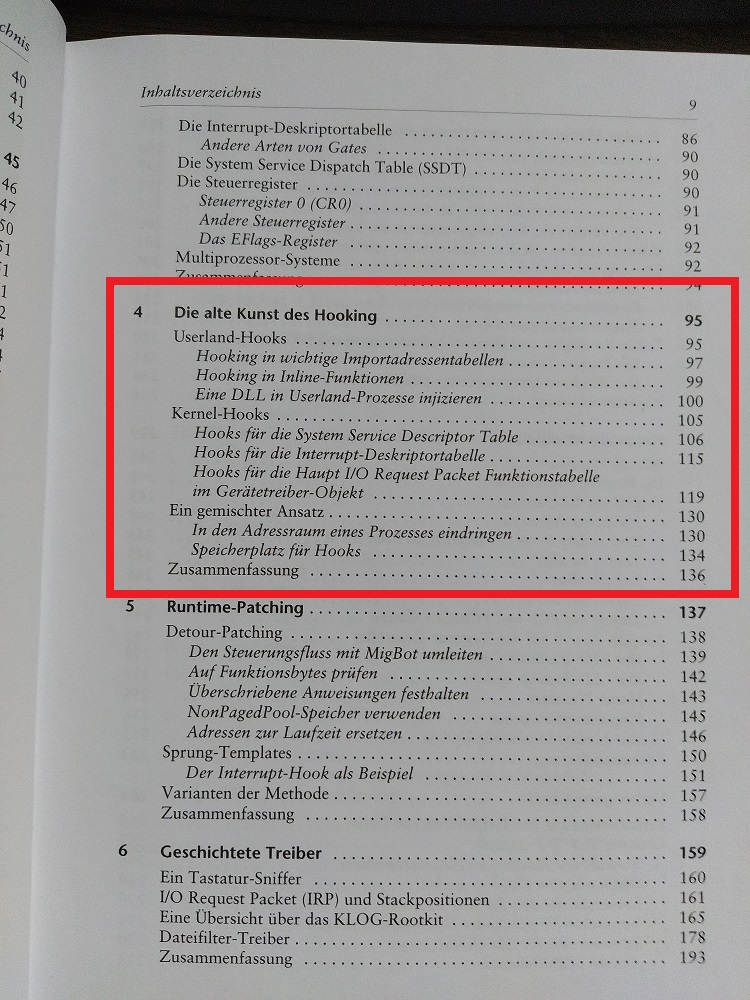
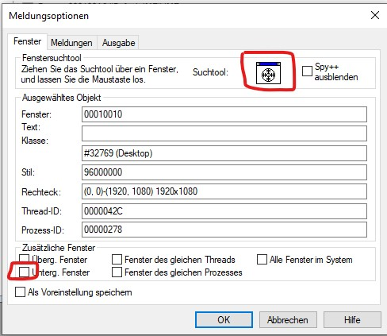
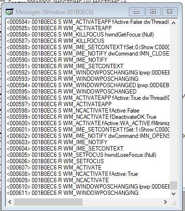

A few months ago my computer mouse stopped working so I bought one of those cheap ones. It is workign like a charm but unfortunatelly it has two very very anoying side buttons:


I don't remember ever using them. Most of the time they and me coexist peacefully but sometimes (often when my wife is in front of the computer) the get clicked accidentally. It is not a drama after all, you think? Well it is if you are sitting in front of your email provider's sending mask, typing a large text into it and accidentally click this strange side button that is mapped to the *back* button...

So I always wanted to get rid of them, but:

+ Windows is not able to control those buttons
+ the manufacturer does not provide a software for it
+ removing the buttons from the mouse is not really a satisfactory solution for that problem

# The very last solution
Today I scanned my bookshelf and suddenly an old book, bought and read about 12 years ago, catches the eye:


After reading the table of contents:



I saw the part with *Hooks*. And suddenly something I've done several years ago came back into my mind. Windows is based upon a [message system](https://docs.microsoft.com/en-us/windows/win32/winmsg/messages-and-message-queues) and there is a powerful function that let's you inspect every message. And in one case you are also able to modify the messages. So maybe you got my idea: Listen to a specific message and omit it so that the mouse clicks never reaches any application.

# Windows Message
If you press a key, some sends somewhere a `*WM_CHAR*` message. If you press the left mouse button, a `*WM_LBUTTONDOWN*` is sent. Those events are fetched by applications that respond to them or omit them.
E.g. having a WPF application with just a single button:


Introduces a consumer of `*WM_LBUTTOMDOWN*` events and of course it also consumes the corresponding `*WM_LBUTTONUP*` events.

# See windows messages in action
If you have `Visual Studio` installed, you have access to a little tool from Microsoft, called `Spy++`. You find it in the installation directory, e.g.:

```
C:\Program Files (x86)\Microsoft Visual Studio\2019\Professional\Common7\Tools
```

The folder contains two versions, a 32 Bit and a 64 Bit version. You must choose it based on the bitness of the application you want to inspect. The WPF application is JITed as 32Bit application so I open that version. Click onto the button I've marked red in this screenshot. A new window appears:




Now click onto the crossfade, hold the button, move it over the application you are interested in and click the "*OK*" button. You are now tracing that application:



You see, there is a bunch of messages that were emitted all the time.

# Determine the right message
So you know that there is a message if something happens on the keyboard or the mouse. How do you know what message we are interested in? Just trigger it and "listen" to the message stream. In this case I recommend to remember the last row number:


Then place the mouse over the test app and press one of the side button. In my case the last message right before the click was: **1730** Right click onto the message stream and stop recording:


You now have a bunch of new messages. I wish you luck in finding the right one :smile: In my case I assumed that `WM_XBUTTONDOWN` is what I am looking for:


Of course, just an assumption.

# Blocking a message


wichtig beim wechsel des buildprofiesl: hinzufügend er def.def

# Header

----

# Found a typo?
As I am not a native English speaker, it is very likely that you will find an error. In this case, feel free to create a pull request here: https://github.com/gabbersepp/dev.to-posts . Also please open a PR for all other kind of errors.

Do not worry about merge conflicts. I will resolve them on my own. 
