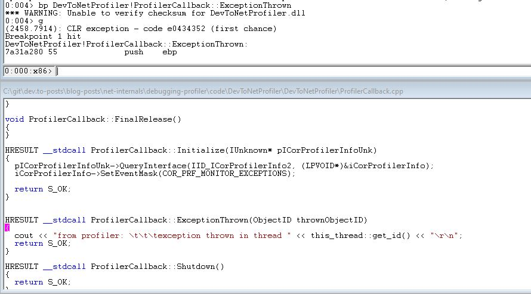

In this article I just summarize shortly how you can apply what I've already written to profiler:



# Code example
I just copied the [code from the last article](https://github.com/gabbersepp/dev.to-posts/tree/master/blog-posts/net-internals/how-does-profiler-work/code/DevToNetProfiler). Our goal is to set a breakpoint in `ProfilerCallback::ExceptionThrown` in line `33`. then we can inspect the parameter `objectID`. I will do this very quickly. If you want more information, go to the blog post I mentioned.

# Howto
+ Add a `Console.Read();` at the very beginning of the .NET test application. This gives us time to attach a debugger
+ Start app by executing `start.bat`
+ Start WinDbg & attach to process of `TestApp`
+ set breakpoint: `bp DevToNetProfiler!ProfilerCallback::ExceptionThrown`
+ enter `g + enter` to continue
+ enter any key in your `TestApp`
+ your breakpoint should be hit and you should see the source code:

+ go to `View > Locals` to list all local variables, includind parameters:

----

# Found a typo?
As I am not a native English speaker, it is very likely that you will find an error. In this case, feel free to create a pull request here: https://github.com/gabbersepp/dev.to-posts . Also please open a PR for all other kind of errors.

Do not worry about merge conflicts. I will resolve them on my own. 
