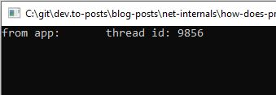

>**[Get the code for this tutorial](https://github.com/gabbersepp/dev.to-posts/tree/master/blog-posts/net-internals/how-does-profiler-work/code/DevToNetProfiler)**

# Introduction
In the last article we built a small runnable example. To start just use the template we created there. If you don't have it yet, visit the article and download the base profiler project.



>**Attention!** Most of the functions that are used to query information from the profiler return a `HRESULT`. You should check if this value is `0` (error) or not. For the sake of simplicity I will ommit all those checks because they make the code harder to understand. This counts for all following blog posts about this topic.

# Profiler loading
As mentioned in the first post, the profiler is loaded along with the application. If the profiler is called, it is called by the application's thread. If multiple threads are running in your app and every thread triggers events, all those events arive "at the same time" at your profiler in different threads. So you have to ensure that your profiler is threadsafe.

## ICorProfilerCallback
Our profiler must implement that interface. Do you remember all those stubs we created? That are callbacks called by the CLR on certain events.

## ICorProfilerInfo
The profiler should request an instance of type `ICorProfilerInfo`. This object is a bridge between the profiler and the profiled app. You can request the function name for a given function id for example. We will see some of it's power in the next articles.

## Lifecycle
Well there are two functions that can somehow be identified as `Lifecyclefunctions`. 
+ **Initialize()** is called after the CLR has initialized and loaded up the profiler. This is a very important point in time because it is the only place where you can setup the profiler.
+ **Shutdown()** is called when the application gets closed

## Initialize
We will focus on **Initialize** because as already said, you must setup your profiler. 
What you must do:
+ request an instance of type `ICorProfilerInfo` (or any newer version - you know, the numeric suffix)
+ set flags to tell the CLR which events you want to receive
+ maybe set some hooks (we will see this later)

**Necessary steps:**

+ add `include <corprof.h>` 
+ add `CComQIPtr<ICorProfilerInfo2> iCorProfilerInfo;` variable to the outside of the class. 
+ add `pICorProfilerInfoUnk->QueryInterface(IID_ICorProfilerInfo2, (LPVOID*)&iCorProfilerInfo);` to `Initialize()`

The `include` is required because it contains the definition of `IID_ICorProfilerInfo2`. The `iCorProfilerInfo` variable should not be an instance variable. This makes it much easier to handle. We need it later on to request metadata about the application.

**Flags:**

`ICorProfilerInfo` has a method `SetEventMask()`. You must pass a `DWORD` that reflects the events you want to be notified. A full list of all flags can be found [here](https://docs.microsoft.com/de-de/dotnet/framework/unmanaged-api/profiling/cor-prf-monitor-enumeration). In this example I choose `COR_PRF_MONITOR_EXCEPTIONS` because I want to monitor all exceptions that occur:

```cpp
  iCorProfilerInfo->SetEventMask(COR_PRF_MONITOR_EXCEPTIONS);
```

Depending on the flags you set you can use different callback methods (that are all those stubs we created in `ProfilerCallback.cpp`). In order to know which one you need, go the [the documentation](https://docs.microsoft.com/de-de/dotnet/framework/unmanaged-api/profiling/cor-prf-monitor-enumeration) and search for `COR_PRF_MONITOR_EXCEPTIONS`:


## ExceptionThrown Callback

We focus on the `ExceptionThrown` callback and fill it with some stupid logic:

```cpp
HRESULT __stdcall ProfilerCallback::ExceptionThrown(ObjectID thrownObjectID)
{
  cout << "from profiler: \t\t\texception thrown\r\n";
  return S_OK;
}
```

Adjust the `Program.cs` of the test app and throw an exception:

```cs
static void Main(string[] args)
{
  try
  {
    throw new Exception();
  }
  catch
  {

  }

  Console.Read();
}
```

Now compile everything and execute `start.bat`:


Congratulations, you created your first profiler!

# Threading
Let's see in which thread a profiler is executed. We keep the code from the sections above but adjust the `ExceptionThrown` callback a bit. I suggest to print the current thread id. This can be done by including `<thread>` and adjusting the message:

```cpp
// ./code/DevToNetProfiler/DevToNetProfiler/ProfilerCallback.cpp#L31-L35

HRESULT __stdcall ProfilerCallback::ExceptionThrown(ObjectID thrownObjectID)
{
  cout << "from profiler: \t\t\texception thrown in thread " << this_thread::get_id() << "\r\n";
  return S_OK;
}
```

Also you should print the thread id in your `C#` app:

```cs
// ./code/DevToNetProfiler/TestApp/Program.cs#L8-L21

static void Main(string[] args)
{
  try
  {
    throw new Exception();
  }
  catch
  {

  }

  Console.WriteLine($"from app:\tthread id: {AppDomain.GetCurrentThreadId()}");
  Console.Read();
}
```

And this should be the result:


Both components have the same thread id.

# Bitness
As always when dealing with native code, you must take the bitness into consideration. This is especially true if you want to use `FunctionEnter/Leave` callbacks. 
The simple rule is: If the .NET app runs as 32Bit app, your profiler must be compiled as 32Bit profiler and vice-versa.

## .NET and bitness
Read this article, if you want to read more about bitness in .NET and `Visual Studio`:


## What happens if we ignore the bitness?
Let the profiler being compiled to 32Bit and set the TestApp to 64Bit. The message from the profiler is missing now:



Additionaly we can find an error message in the windows event viewer:


# Summary
This article showed the basics of a profiler. I think this is enough to get an insight. Do you miss some information that seems relevant to you? Let me know!

In the next articles I want fo focus on some use cases. Stay tuned if you want to see some assembler code! 

----

# Found a typo?
As I am not a native English speaker, it is very likely that you will find an error. In this case, feel free to create a pull request here: https://github.com/gabbersepp/dev.to-posts . Also please open a PR for all other kind of errors.

Do not worry about merge conflicts. I will resolve them on my own. 
